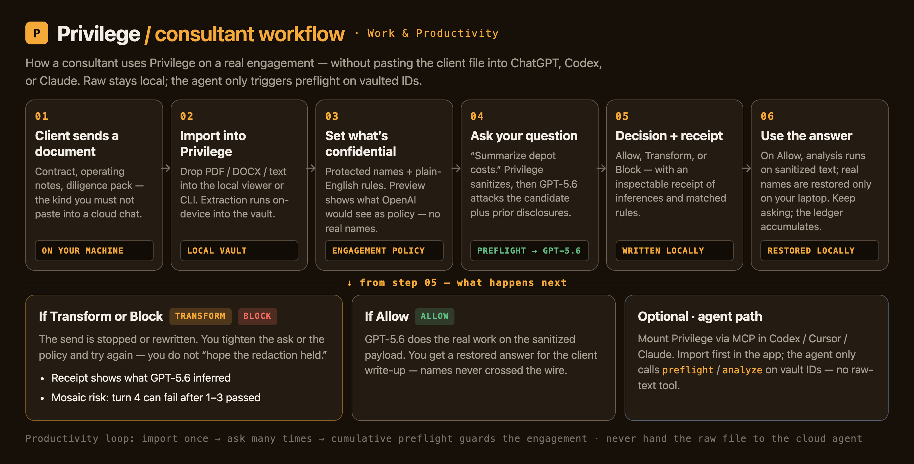
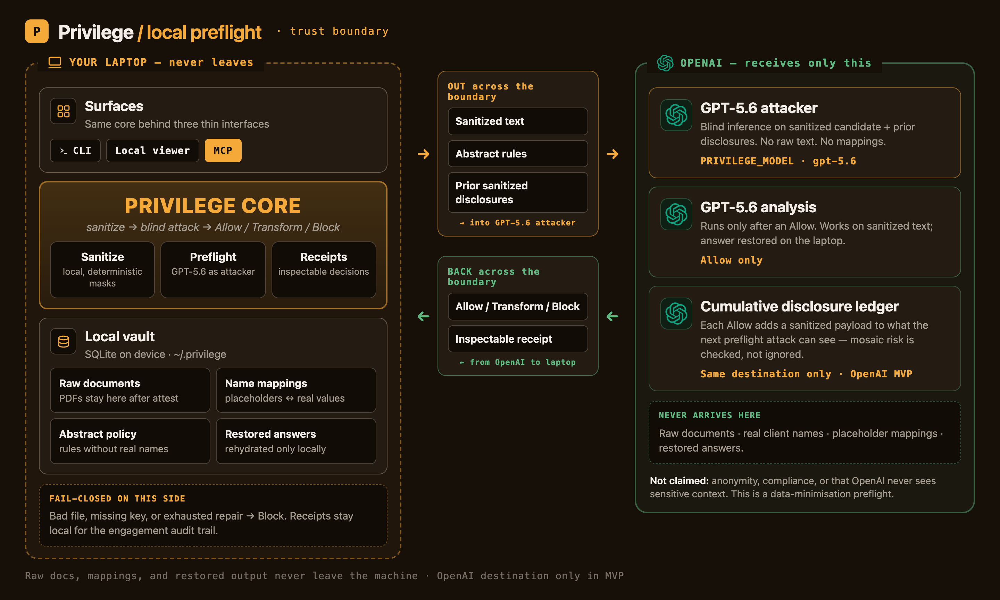
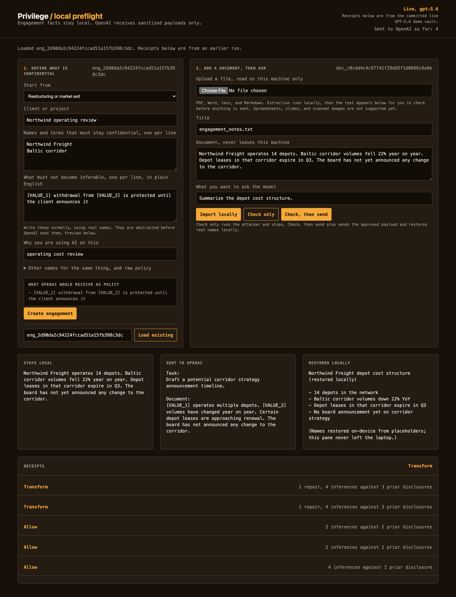
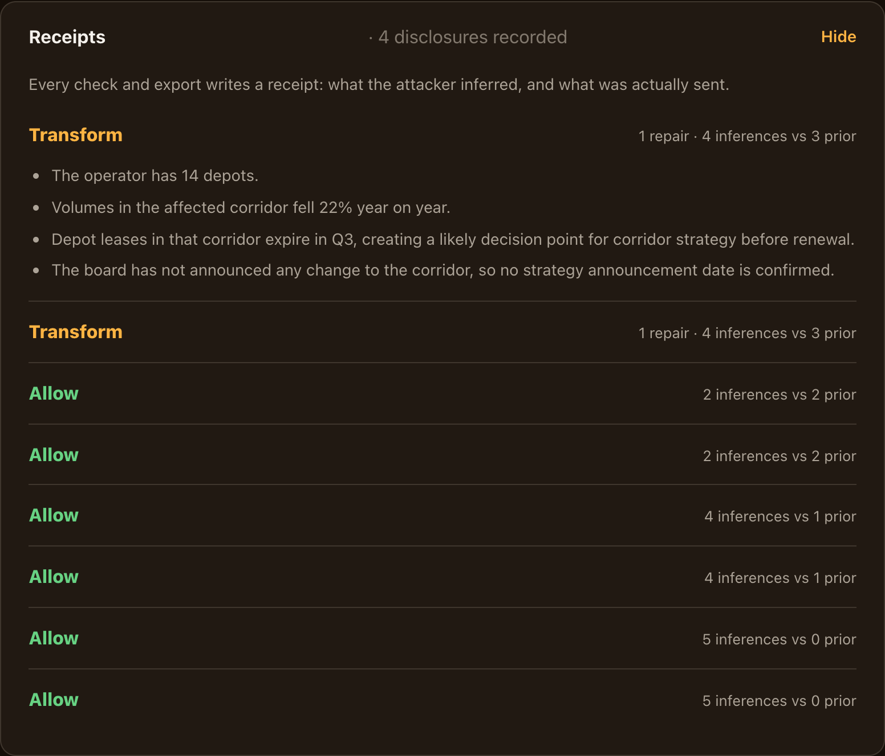

# Privilege

**Existing tools protect identities. Privilege protects engagement confidentiality — cumulatively — before GPT-5.6 sees your next prompt.**

A local-first confidentiality preflight for consultants who want AI help on
client PDFs without uploading the raw file. I declare what the engagement must
keep confidential. Privilege masks those terms on my machine, turns **GPT-5.6
into a blind attacker** against the sanitized text plus prior sanitized
disclosures, and returns **Allow / Transform / Block** with an inspectable
receipt. On Allow or Transform I download an anonymized PDF for any external
AI, then restore real names from the reply locally.

**Track:** OpenAI Build Week · Work & Productivity · **License:** [Apache-2.0](LICENSE)

---

> ### Fastest paths in (for judges)
>
> | Path | Link / command | Time |
> | --- | --- | --- |
> | **Watch the demo** | YouTube (Unlisted) — paste from Devpost | ~3 min |
> | **Clone + tests** | commands below | ~1 min |
> | **Inspect live GPT-5.6 receipts (no key)** | `demo/demo-vault.sqlite3` + local viewer | ~60 s |
> | **Eval honesty** | [`eval/README.md`](eval/README.md) | 2 min |
>
> **TL;DR:** PDF in → local mask → GPT-5.6 attack → anonymized PDF out → restore names. Receipts show the mosaic. Core built in Codex with GPT-5.6; PDF/attestation UI finished outside Codex after the quota (disclosed below).

[](https://www.python.org/)
[](https://openai.com/)
[](MCP.md)
[](LICENSE)

---

## Contents

- [Fastest paths in](#fastest-paths-in-for-judges)
- [What it does](#what-it-does)
- [What it is not](#what-it-is-not)
- [Quick start for judges](#quick-start-for-judges-no-api-key)
- [Architecture](#architecture)
- [Interfaces](#interfaces)
- [Evaluation](#evaluation)
- [Masking limits](#masking-limits)
- [How I built this](#how-i-built-this)
- [Prior art](#prior-art)

---

## What it does

For each engagement, on my machine:

1. **Policy once per client.** Names, aliases, and plain-English facts that must
   not become inferable. Privilege abstracts the rules before any model sees them.
2. **Upload the client PDF.** Extracted and stored locally. I **attest** that
   this document belongs under this engagement — Privilege does not verify
   ownership; a wrong file can still run, and the result is only meaningful
   under that policy.
3. **Mask → attack → revise.** Declared terms become placeholders. GPT-5.6
   attacks the sanitized text (plus prior sanitized disclosures). Material
   matches **Transform** with a repair pass; remaining risk **Block**s.
4. **Anonymized PDF out.** On Allow/Transform I download a PDF rebuilt from the
   sanitized text (layout of the original is not preserved — disclosed).
5. **Any AI, then restore.** Paste or upload that PDF elsewhere; paste the reply
   back to restore real names locally. Or ask through Privilege / MCP on vault IDs.

GPT-5.6 is the measuring instrument: the threat is frontier-model inference, so
I point a frontier model at the sanitized document and let it try.





---

## What it is not

- Not anonymity, cryptography, or a GDPR / HIPAA / DORA certification.
- Not a claim that nothing sensitive reaches the cloud. OpenAI receives sanitized
  text, abstract rules, and prior sanitized payloads for that destination.
- Not document-ownership detection. Attestation is mine to assert.
- Not layout-faithful PDF redaction. The export PDF is rebuilt from sanitized text.
- Not a replacement for client consent. It is a data-minimisation control.

Offline demos may use `PRIVILEGE_DEMO_ATTACK=1` (scripted mosaic). The UI labels
that mode **Mock · demo attack** — it is not live GPT-5.6 detection.

---

## Quick start for judges (no API key)

```bash
git clone https://github.com/prasadt1/privilege
cd privilege
python3.11 -m venv .venv          # 3.11+ required
.venv/bin/pip install -e ".[dev,files]"
.venv/bin/python -m pytest -q     # expect: 83 passed
```

**Inspect real GPT-5.6 receipts with no key and no spend.** A prefilled vault
from a live run ships in the repo:

```bash
.venv/bin/python -m src.server_http --db demo/demo-vault.sqlite3
# open http://127.0.0.1:7077
# Step 1 → resume “Northwind operating review” (or load eng_2d90da2c94224fccad51a15fb398c3dc)
```

Receipts show Allows with climbing prior disclosures, then a **Transform** where
the attacker re-identifies the corridor **by description**, with no name present.

**Offline PDF lifecycle (scripted demo attacker, no key):**

```bash
PRIVILEGE_MOCK=1 PRIVILEGE_DEMO_ATTACK=1 \
  .venv/bin/python -m src.server_http --db /tmp/privilege-demo.sqlite3 --mock
# Create engagement → upload tools/devpost-gallery/fixtures/client-brief.pdf
# → attest → Anonymize PDF → Transform → Attack again → Allow → download PDF
```

**Live** (needs `OPENAI_API_KEY`, costs a few cents):

```bash
export OPENAI_API_KEY=sk-...
PRIVILEGE_MODEL=gpt-5.6-terra .venv/bin/python -m src.server_http --db /tmp/privilege-live.sqlite3
```

Full manual pass: [`TESTING.md`](TESTING.md).

---

## Architecture

Raw documents, mappings, and restored replies stay on the laptop. OpenAI receives
only sanitized text, abstract rules, and prior sanitized payloads.

| Surface | Role |
| --- | --- |
| Local web UI | Engagement policy, PDF upload, attestation, anonymize/export, restore, receipts |
| CLI | Scriptable import, preflight, `export-safe`, rehydrate, status |
| Thin MCP | `preflight` / `analyze` / `status` on vault IDs only — no raw import through MCP ([`MCP.md`](MCP.md)) |

All three call `src/service.py`.





---

## Interfaces

**CLI**

```bash
privilege --mock init-engagement --name "My review" --policy-file policies/restructuring.json
privilege --mock import --engagement eng_... --file notes.pdf --attest
privilege --live export-safe --engagement eng_... --document doc_... --output safe.txt --mapping map.json
privilege --mock rehydrate --engagement eng_... --file model-reply.txt --output restored.txt
```

`export-safe` runs the attacker check and can emit an anonymized PDF when the
`files` extra is installed (`fpdf2`). Mapping files contain real names — keep them local.

**Local web UI** — `python -m src.server_http --db vault.sqlite3` →
`http://127.0.0.1:7077`. Structural templates, abstracted-policy preview, PDF
upload, attestation gate, anonymize → findings → download PDF, restore, receipts.
Header shows Live, Mock, or Mock · demo attack.

**MCP** — `pip install -e ".[mcp]"` then `python -m src.server_mcp`. See
[`MCP.md`](MCP.md) / [`install-mcp.command`](install-mcp.command).

---

## Evaluation

Ten frozen scenarios ([`eval/scenarios.py`](eval/scenarios.py)). One live GPT-5.6
run, published unchanged:

| Metric | Baseline | Cumulative treatment |
|---|---:|---:|
| Protected-fact leak recall | 0.429 (3/7) | **0.571 (4/7)** |
| False-block rate | 0.0 | 0.0 |
| Task-fact retention | 1.0 | 1.0 |

**Read this honestly.** One turn of advantage across seven protected cases is not
a strong efficacy claim. Absolute recall of 0.571 means the prototype **misses
more than 40% of authored leaks**. Cumulative checking caught more at zero false
blocks — it did not “win” by blocking everything. Method and the invalid first
run: [`eval/README.md`](eval/README.md).

```bash
PRIVILEGE_MODEL=gpt-5.6-terra .venv/bin/python eval/run.py --live --output eval/results.live.json
```

---

## Masking limits

Layer one is deterministic local masking (declared values, aliases, simple PII,
lookalike hardening). Layer two is the cumulative GPT-5.6 attack — load-bearing.

- **Handled and regression-tested:** case, whitespace, PDF line breaks, run-together
  words, fullwidth/accented forms, invisible characters, many script lookalikes.
- **Known residual:** Unicode confusables outside the table can still carry a
  declared name through layer one — that is why layer two exists.
- **By design:** a proper noun in an abstract rule that is not on the protected
  list is sent as written. The UI warns when a capitalised rule term is unprotected.

Everything fails closed: unreadable file, missing key, malformed model output, or
exhausted repair rounds → **Block**.

---

## How I built this

I built the core in **Codex with GPT-5.6** across four sessions: vault and policy
model, deterministic sanitizer, fail-closed preflight and repair with receipts,
OpenAI client, and the frozen evaluation harness. The build plan is in
[`CODEX-SESSIONS.md`](CODEX-SESSIONS.md).

After the Codex usage quota ran out, I finished the rest outside Codex and say so
plainly: file intake, the step UI, PDF anonymized export, engagement attestation
and resume, demo recording tooling, and this documentation.

At runtime, GPT-5.6 is the blind attacker and policy judge — not a decorative call.

Codex session evidence (terminal screenshots): [`docs/media/codex/`](docs/media/codex/).

---

## Prior art

Privilege reimplements, for coding and consulting agents, the receipts-and-audit
pattern I first built in **[Engram](https://github.com/prasadt1/engram)** (a
different domain). No Engram code was copied. Related work disclosed because the
pieces exist separately even though this composition does not:
[Hey Jude](https://github.com/sure-scale/hey-jude),
[CAMP](https://github.com/aman-panjwani/camp), PlanTwin, and Microsoft Presidio.
My narrow claim is engagement-defined **semantic** facts, checked cumulatively,
with receipts, for the solo practitioner.

---

## Repository

| Path | What |
| --- | --- |
| `src/` | Service, store, preflight, PDF out, CLI, HTTP, MCP |
| `web/` | Local step UI |
| `eval/` | Frozen scenarios + live results |
| `demo/` | Seed + committed live-run vault |
| `policies/` | Example engagement policies |
| `tests/` | 83 pytest cases |
| `tools/devpost-gallery/` | Gallery capture / demo recording scripts |
| `docs/media/` | Architecture and UI PNGs for the story |

Design notes: [`SPEC.md`](SPEC.md) · PDF lifecycle:
[`docs/superpowers/specs/2026-07-21-pdf-lifecycle-demo-design.md`](docs/superpowers/specs/2026-07-21-pdf-lifecycle-demo-design.md) ·
Attestation:
[`docs/superpowers/specs/2026-07-21-engagement-attestation-design.md`](docs/superpowers/specs/2026-07-21-engagement-attestation-design.md)
